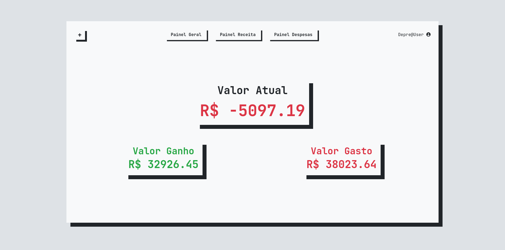
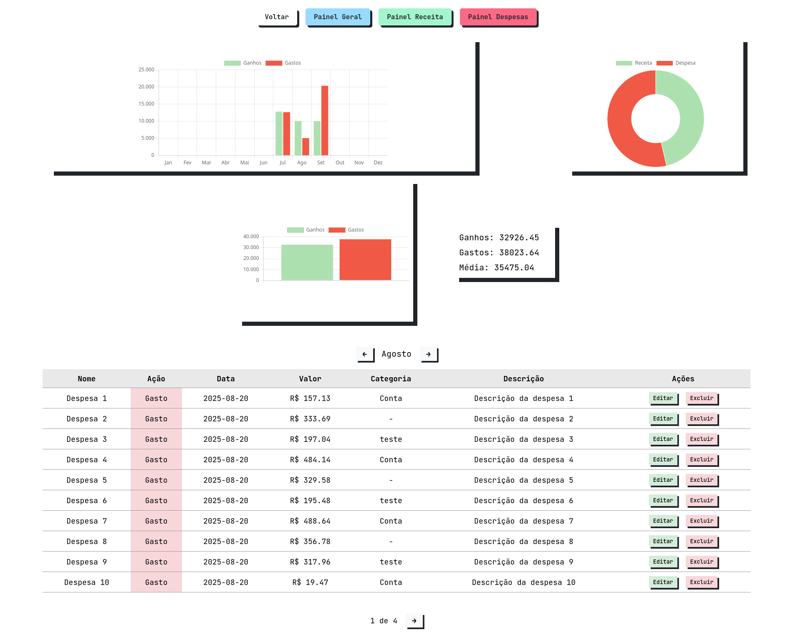

# Gestor Financeiro


# Financial Manager


The **Financial Manager** is a web application designed to help with **personal finance management**.  
With it, users can register **income, expenses, and current balance**, as well as view **monthly reports and charts** to make financial tracking easier.

The system is intended to be **simple, fast, and intuitive**, providing features such as:

-   Registering income and expenses with date and category
-   Monthly chart of income and expenses (using Chart.js)
-   Automatic calculation of current balance
-   Financial transaction history
-   Responsive and user-friendly interface

The goal is to provide a practical tool for those who want to **organize their personal finances** or **track the cash flow** of small projects/businesses.





## 🛠️ Technology

-   Python 3.13.7
-   FastAPI
-   MySQL/MariaDB
-   HTML + CSS + JavaScript
-   Chart.js

## 📦 Installation

Clone the repository and install the dependencies:

```bash
git clone https://github.com/DevDepre/Gestor-Financeiro.git
cd <Gestor-Financeiro>
pip install -r requirements.txt
```

## ▶️ Usage

Run locally:

```bash
uvicorn main:app --reload
```

Access at: `http://127.0.0.1:8000`

## 🤝 Contributing

Contributions are welcome!  
To contribute:

1. Fork the repository
2. Create a new branch (`git checkout -b my-feature`)
3. Commit your changes (`git commit -m 'Added new feature'`)
4. Push to the branch (`git push origin my-feature`)
5. Open a Pull Request
